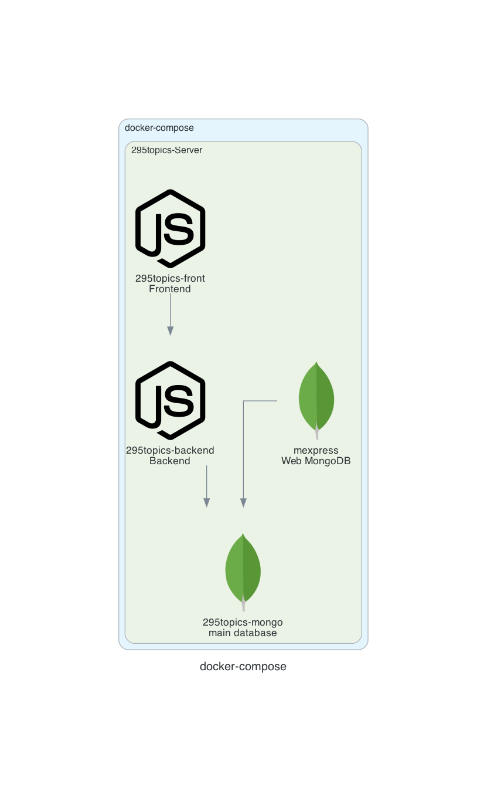
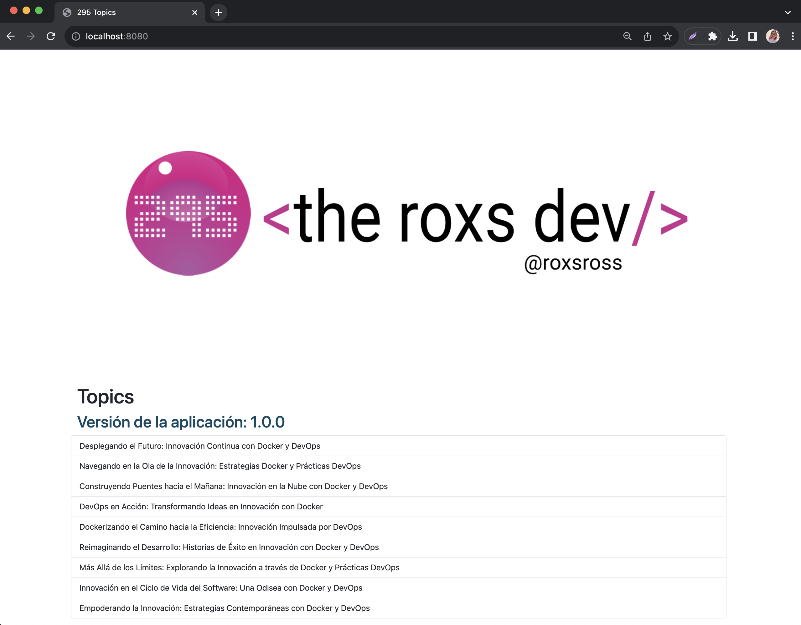
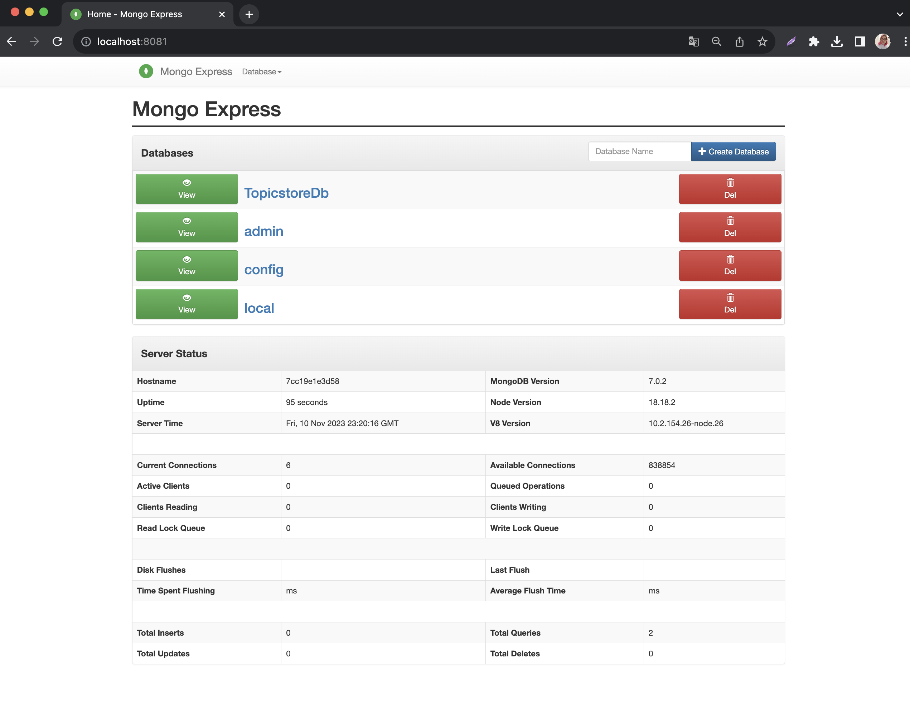
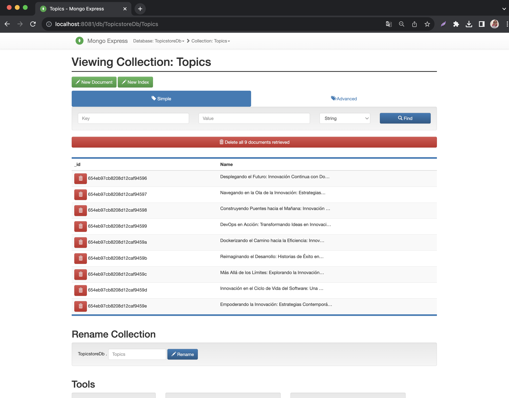
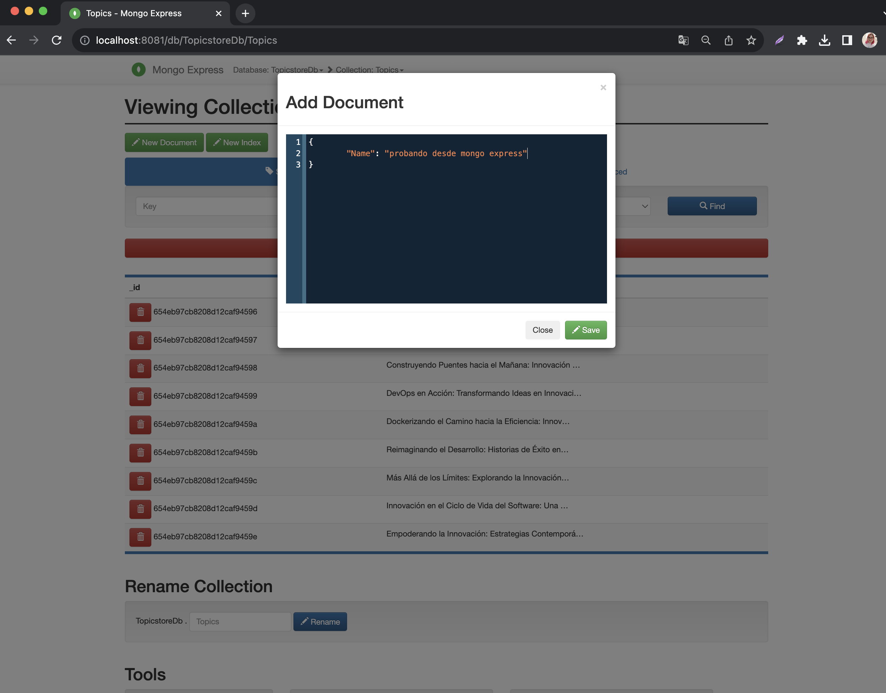
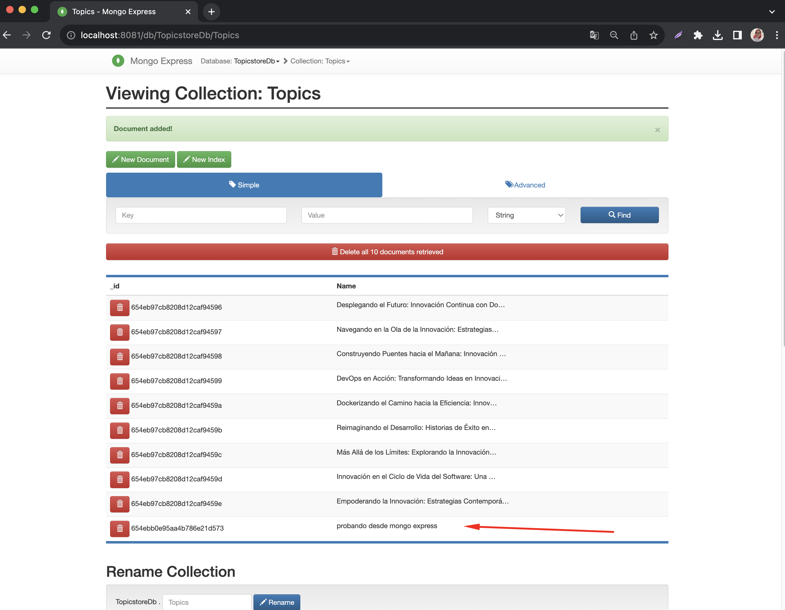
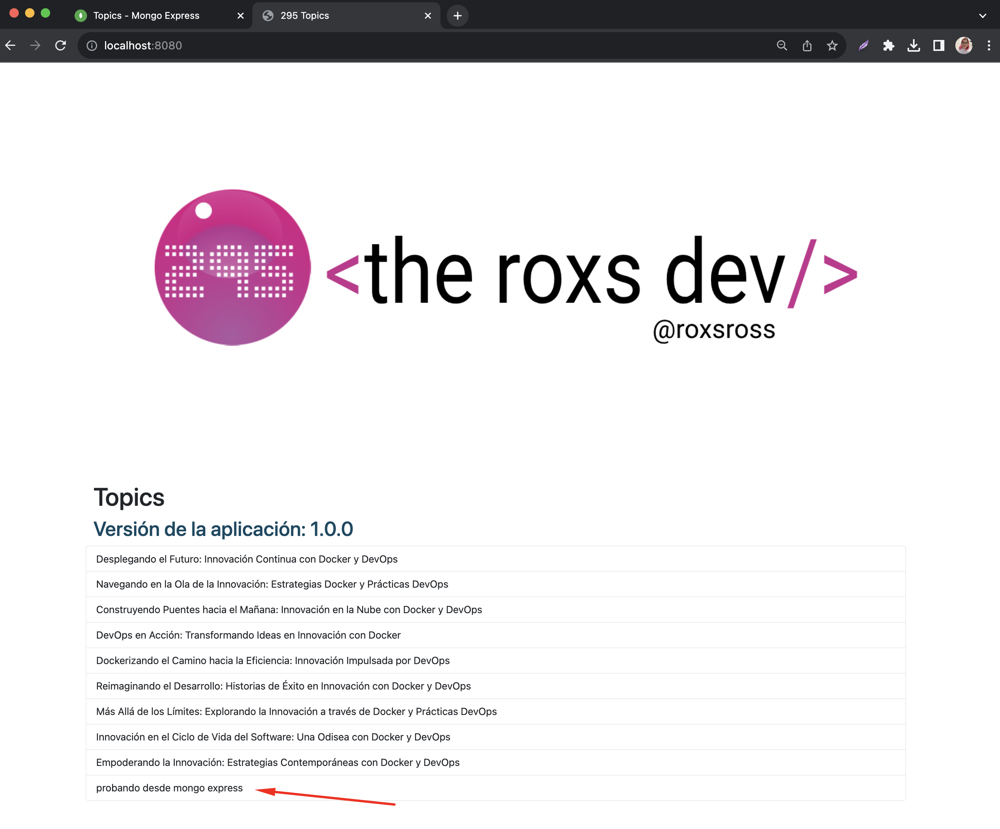

# "Despliegue la Aplicación '295topics' con Docker y Docker Compose"

### Descripción del Desafío:

El desafío se centra en la configuración de la aplicación "295topics" que consta de un frontend Node.js, un backend TypeScript y una base de datos MongoDB utilizando contenedores Docker y Docker Compose. 

El objetivo es asegurar que la aplicación sea escalable, fácil de administrar y se pueda desplegar de manera eficiente.

### Arquitectura:

Debes aplicar tus habilidades de DevOps para containerizar y gestionar la aplicación "295topics".

Esta aplicación consta de tres componentes principales:

- Frontend en Node.js y Express: Este componente sirve contenido web en el puerto 3000. Deberás crear un Dockerfile para el frontend, construir la imagen y publicarla en Docker Hub.

- Backend en TypeScript: Este componente se ejecuta en el puerto 5000 y se conecta a una base de datos MongoDB. Deberás crear un Dockerfile para el backend, construir la imagen y publicarla en Docker Hub.

- Base de Datos MongoDB: La base de datos se iniciará a través de un contenedor de MongoDB. Además, deberás proporcionar un archivo mongo-init.js que cargue datos iniciales en la base de datos cuando se inicie el contenedor de MongoDB.



## Requisitos:

### Frontend en Node.js y Express:

- Se proporciona el código fuente del frontend en Node.js y Express 
el mismo utiliza el puerto 3000 para exponerse a Internet.
- Crea un Dockerfile para el frontend que incluya todas las dependencias necesarias y establezca el comando de inicio.
- Construye la imagen del frontend utilizando el Dockerfile.
- Publica la imagen en Docker Hub.
- Se debe tomar en cuenta que consume el endpoint del backend
a traves de la variable `API_URI` en donde se conectara con el backend

Por ejemplo: `API_URI: http://topics-api:5000/api/topics`

### Pruebas front
    Se puede realizar pruebas de conexion `http://localhost:3000`
    Recuerden siempre revisar los logs

### Backend en TypeScript:

- Se Proporciona el código fuente del backend en TypeScript que utiliza el puerto 5000 y se conecta a una base de datos MongoDB.
- Crea un Dockerfile para el backend que incluya todas las dependencias necesarias y establezca el comando de inicio.
- Construye la imagen del backend utilizando el Dockerfile.
- Publica la imagen en Docker Hub.

tomar en cuenta variables de entorno:
```
DATABASE_URL=
DATABASE_NAME=
HOST=
PORT=
```

en el archivo config.ts estan las variables de conexion a la base de datos

```
export default {
    database: {
        url: process.env.DATABASE_URL || 'mongodb://localhost:27017',
        name: process.env.DATABASE_NAME || 'TopicstoreDb'
    },
    app: {
        host: process.env.HOST || 'localhost',
        port: +process.env.PORT || 5000
    }
}
```
Es importante el uso de las variables de entorno

### Pruebas backend
    Se puede realizar pruebas de conexion `http://localhost:5000/api/topics`
    recuerden revisar los logs


### Base de Datos MongoDB:

Se entrega archivo mongo-init.js en la [ruta](../295topics-fullstack/db/mongo-init.js)  que sirve para  precargar datos a la base de datos MongoDB.
se debe Configura un contenedor Docker para ejecutar una instancia de MongoDB.
Utiliza el archivo mongo-init.js para precargar datos en la base de datos.

### Pruebas mongodb
    Pueden usar el contenedor para conectarse y revisar la ingesta de los datos o usar directamente mongo express
    los pasos seria siguiente:

### Se agregan registros a la base de datos
```bash
docker exec -it some-mongo mongosh

> use TopicstoreDb

> db.Topics.insertOne({Name:"Docker"})

> db.Topics.insertOne({Name:"Kubernetes"})
> show collections;
> db.Topics.find();
```

### Mongo Express:

Configura un contenedor Docker para ejecutar Mongo Express y asegura que esté conectado a la base de datos MongoDB.

### Docker Compose:

Crea un archivo docker-compose.yml que defina los servicios para el frontend, el backend, la base de datos MongoDB y Mongo Express.

Establece las dependencias adecuadas entre los servicios para garantizar que se inicien en el orden correcto.

Verifica que la aplicación se ejecuta correctamente con docker-compose up.
Asegúrate de que el frontend puede comunicarse con el backend a través del endpoint correspondiente.


#### Desafío Adicional:

Crea un script de automatización (por ejemplo, un script Bash) para la implementación de la aplicación en un entorno de producción.

### Criterios de Evaluación:

- Correcta configuración de los servicios en el archivo docker-compose.yml.
- Precarga exitosa de datos en la base de datos MongoDB utilizando mongo-init.js.
- Correcta exposición de puertos para el frontend y el backend.
- Conexión exitosa entre el frontend y el backend a través de Docker Compose.
- Configuración funcional de Mongo Express para gestionar la base de datos.
- Documentación clara y organización del código fuente.
- Implementación exitosa en un servidor en la nube (si se realiza el desafío adicional).
- Automatización de la implementación (si se realiza el desafío adicional).
- Este desafío brinda la oportunidad de practicar habilidades de DevOps, Docker, Docker Compose y automatización de implementación, al tiempo que se asegura que la aplicación "295topics" se despliegue y gestione de manera efectiva.

### Logros
Este desafío proporciona una experiencia práctica en DevOps, cubriendo desde la creación de imágenes de contenedor hasta la orquestación de servicios y la gestión de bases de datos. Una vez completado, tendrás una aplicación completa que se puede implementar y escalar de manera eficiente utilizando contenedores Docker.

### Resultados







