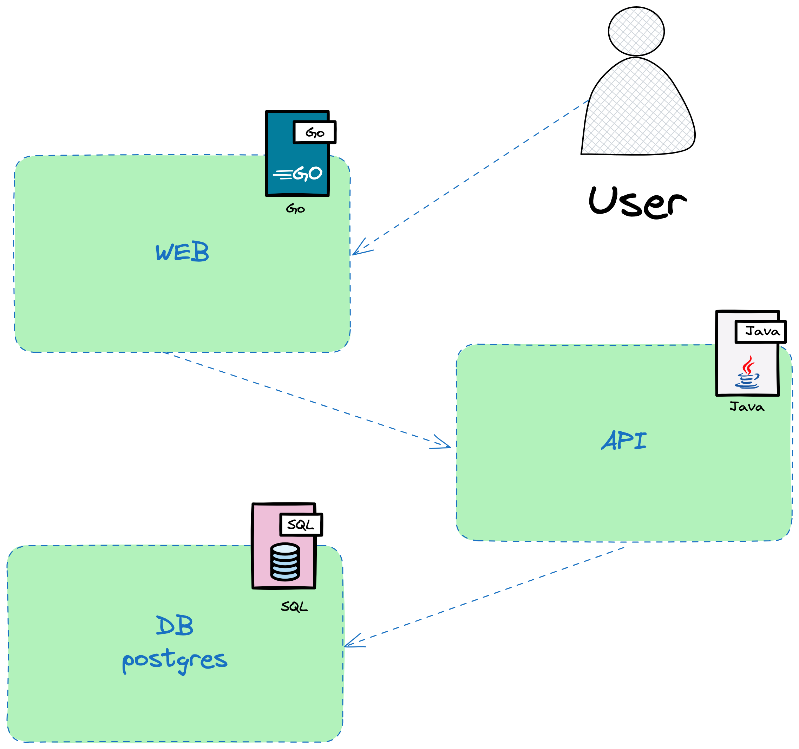
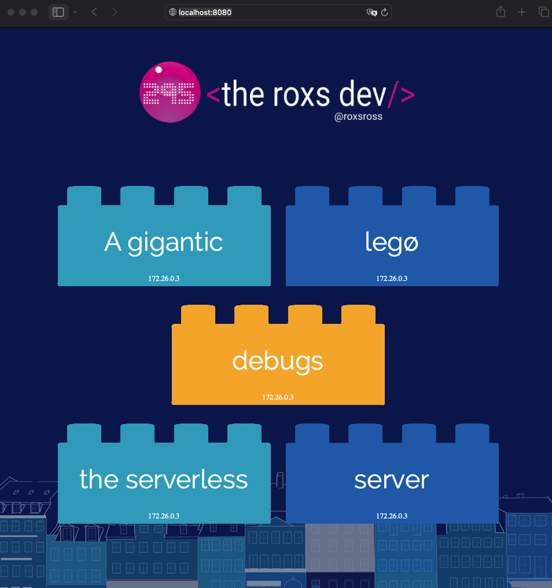
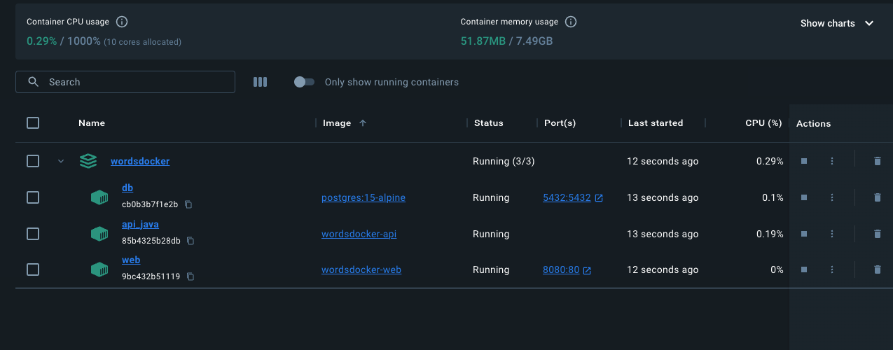

# "Dockerize & Deploy: Desafío Full Stack con Java, Go y PostgreSQL"

El objetivo es automatizar la construcción, pruebas, empaquetado y despliegue de las aplicaciones Java y Go, junto con la base de datos PostgreSQL, utilizando Docker y Docker Compose. Incorporar prácticas de versionado semántico y asegurar una integración continua fluida para garantizar la entrega continua y la estabilidad del sistema."

---

Containerizar una API REST en Java, una aplicación web en Go, una base de datos PostgreSQL, y luego utilizar Docker Compose para orquestar los contenedores. Además, se incluye la subida a Docker Hub y un script bash para manejar versiones que se publican en docker-hub.

Desafío Docker:

## Arquitectura 



### API REST en Java:

Proporciona un proyecto Java que sirva palabras desde una base de datos. Containeriza la aplicación usando un Dockerfile.
```
Version de JAVA >= 18
Version de Maven >= 3
se recomienda el uso de amazoncorretto
Conexion string base de datos: postgresql://db:5432/postgres [linea 24 , Main.java]
Port 8080
```

### Aplicación Web en Go:

La aplicación web en Go que llama a la API Java y convierta las palabras en oraciones. Containeriza la aplicación utilizando un Dockerfile.

```
Imagen recomendada: golang:alpine
```

### Base de Datos PostgreSQL:

Configura una base de datos PostgreSQL que almacene las palabras.

data de inicio [sql](../wordsmith/db/words.sql)

```
Imagen recomendada: postgres:15-alpine
datos de conexion:
POSTGRES_USER: postgres
POSTGRES_PASSWORD: postgres
Recuerde de inyectar los datos antes de iniciar el contenedor
```

### Docker Compose:

Crea un archivo docker-compose.yml que defina servicios para cada contenedor (api, web, db) y configure las conexiones necesarias entre ellos.

### Subida a Docker Hub:

- Crea cuentas en Docker Hub si no las tienes.

- Sube las imágenes de tus contenedores al Docker Hub con versiones semánticas utilizando etiquetas. Puedes usar el comando docker push.

### Script Bash:

Crea un script bash llamado, por ejemplo, deploy.sh que automatice el proceso.
El script debe contener pasos para construir las imágenes Docker, etiquetarlas con versiones, subirlas a Docker Hub y ejecutar Docker Compose.

Utiliza herramientas como git describe o semantic-release para gestionar versiones semánticas automáticamente.

Recuerda documentar adecuadamente tu código, Dockerfiles, y el docker-compose.yml. 

El script bash debería ser ejecutable y fácil de entender para facilitar la automatización del proceso.

Resultados:






