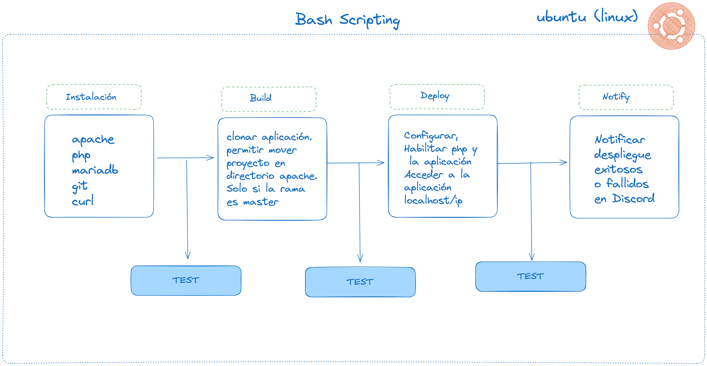
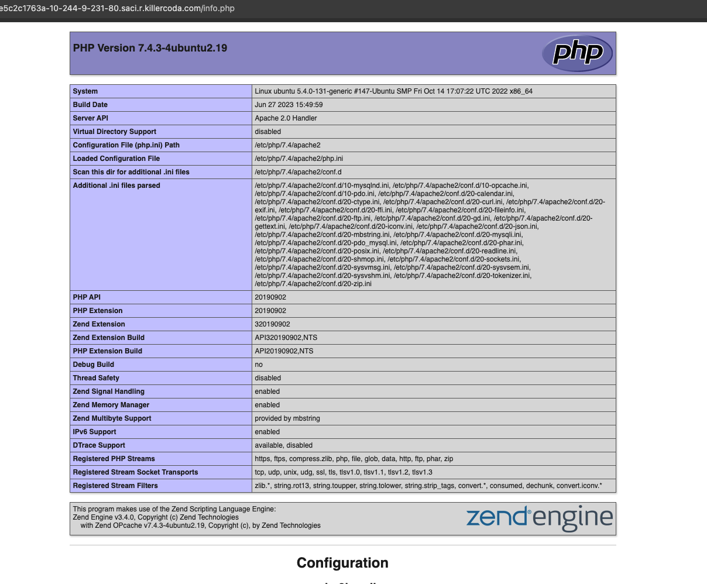
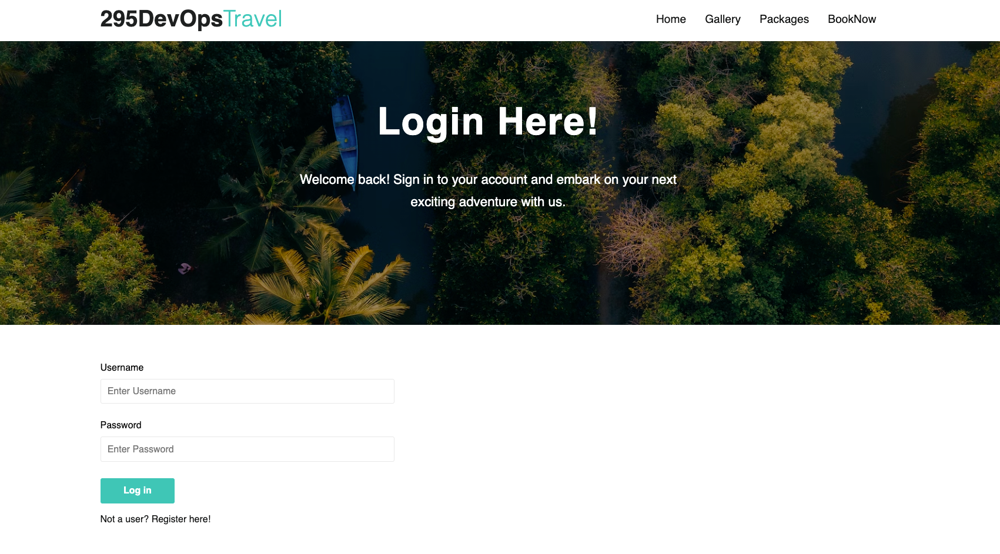
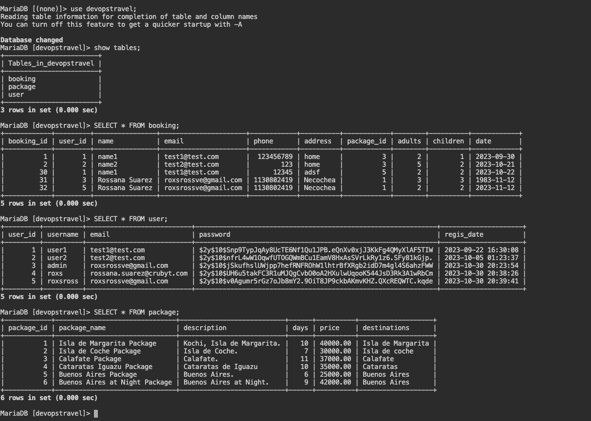
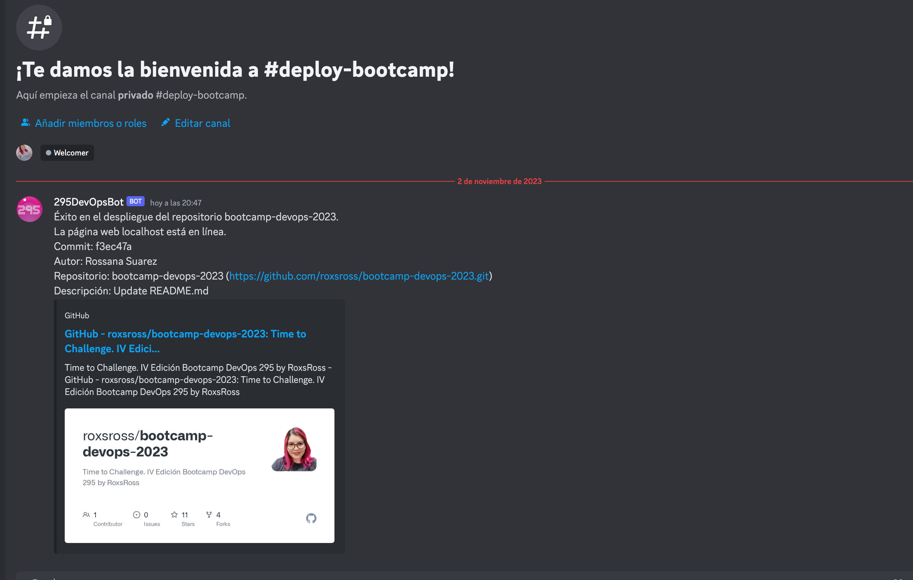

# Ejercicio 1: Automatización "A devops portal to explore."

- Los usuarios pueden reservar paquetes fácilmente a través de esta plataforma fácil de usar en la ubicación deseada.
- El sitio web front-end está creado utilizando HTML CSS y JavaScript.
- Este sitio web se hace flexible y responsivo.
- El Backend de este sitio web está realizado utilizando base de datos php y MySQL.
- El sitio web se ejecuta en el servidor Apache.

## Arquitectura de la Aplicación


En el diagrama de arquitectura, los usuarios inician una solicitud HTTP accediendo a la aplicación a través del navegador utilizando "localhost" o la dirección IP del servidor. El servidor, con Apache instalado, responde entregando el archivo  a los usuarios, solicitándoles que completen sus datos, incluido su nombre, correo electrónico y descripción.

Al completar el formulario, los usuarios envían los datos al servidor. Luego, Apache reenvía los datos enviados a un script PHP responsable de almacenar esta información en la base de datos MySQL. Si los datos se almacenan correctamente, MySQL comunica este éxito al script PHP, que responde con un mensaje HTML que se muestra en el navegador del usuario. Por otro lado, si hay un problema al guardar los datos, el script PHP devuelve un mensaje de error al navegador del usuario, notificándole el problema encontrado.

Esta sólida arquitectura garantiza un flujo fluido de datos entre los usuarios, Apache, PHP y MySQL, proporcionando una experiencia de usuario fluida y una gestión de datos confiable.


## Diagrama de la Aplicación
Incluye los accesos principales

- Home Page
- Gallery 
- Package
- Booking 


### Sobre LAMP

 "LAMP" es un conjunto de aplicaciones de software de código abierto que se suelen instalar juntas para que un servidor pueda alojar aplicaciones y sitios web dinámicos escritos en PHP. Este término es en realidad un acrónimo que representa al sistema operativo Linux, con el servidor web Apache. Los datos del sitio se almacenan en una base de datos MySQL y el contenido dinámico se procesa mediante PHP.

Las letras en LAMP representan:

- Linux: El sistema operativo en el que se ejecutarán las aplicaciones web. Linux es una opción popular debido a su estabilidad y escalabilidad.
- Apache: El servidor web. Apache es uno de los servidores web más utilizados en el mundo y es conocido por ser confiable y altamente configurable.
- MySQL: El sistema de gestión de bases de datos relacional. MySQL se utiliza para almacenar y administrar los datos de la aplicación web.
- PHP (o a veces, Perl o Python): El lenguaje de programación utilizado para desarrollar la lógica de la aplicación web. PHP es el lenguaje más comúnmente asociado con LAMP, pero en algunos casos se pueden usar Perl o Python.

Sistema Operativo: Ubuntu

## Deploy Pre-Requisites

1. Update

```
sudo apt-get update
```

## Instalación de Git
```
sudo apt install git -y
```

## Deploy and Configure Database

1. Install MariaDB

```
sudo apt install -y mariadb-server
sudo systemctl start mariadb
sudo systemctl enable mariadb
sudo systemctl status mariadb
```

2. Configure Database

```
$ mysql
MariaDB > CREATE DATABASE devopstravel;
MariaDB > CREATE USER 'codeuser'@'localhost' IDENTIFIED BY 'codepass';
MariaDB > GRANT ALL PRIVILEGES ON *.* TO 'codeuser'@'localhost';
MariaDB > FLUSH PRIVILEGES;
```

3. Agregar datos a la database devopstravel
Run sql script
ruta: database

```
mysql < database/devopstravel.sql
```

## Deploy and Configure Web

1. Install required packages

```
sudo apt install apache2 -y
sudo apt install -y php libapache2-mod-php php-mysql php-mbstring php-zip php-gd php-json php-curl 
```

2. Iniciar servidor web Apache

```
sudo systemctl start apache2 
sudo systemctl enable apache2 
sudo systemctl status apache2 
```

3. Validar instalación de php

```
php -v
```

4. Configurar apache para que soporte extensión php

> Con la configuración predeterminada de DirectoryIndex en Apache, un archivo denominado index.html siempre tendrá prioridad sobre un archivo index.php

> Si desea cambiar este comportamiento, deberá editar el archivo /etc/apache2/mods-enabled/dir.conf y modificar el orden en el que el archivo index.php se enumera en la directiva DirectoryIndex:

```
 sudo nano /etc/apache2/mods-enabled/dir.conf
```

```
 <IfModule mod_dir.c>
        DirectoryIndex index.php index.html index.cgi index.pl index.xhtml index.htm
</IfModule>
```

Después de guardar y cerrar el archivo, deberá volver a cargar Apache para que los cambios surtan efecto:

```
 sudo systemctl reload apache2
```

5.- Deben insertar en tiempo de despliegue el pass de la bases de datos,
ya que no es buena practica que este la bases de datos en el codigo.
el archivo que conecta a la base de datos en `config.php`

File: config.php

```
<?php
$dbHost     = "localhost"; 
$dbUsername = "codeuser"; 
$dbPassword = ""; 
$dbName     = "devopstravel"; 
$conn = new mysqli($dbHost, $dbUsername, $dbPassword, $dbName); 
if ($conn->connect_error) { 
    die("Connection failed: " . $conn->connect_error); 
}
?>
```

6. Codigo de la Aplicación

```
git clone https://github.com/owner/repositorio
mv /var/www/html/index.html /var/www/html/index.html.bkp
cp -r repositorio/* /var/www/html/
```

6.- Para que tome los cambios

```
 sudo systemctl reload apache2
```

7- Validar funcionamiento de php

```
 curl localhost/info.php
 navegador http://localhost/info.php
```

7.- Acceder a la Aplicación

```
 curl localhost
 navegador http://localhost
```

### Cual es el desafío 

Primero todos los pasos anteriores debe ser automatizado con un script en bash que consideraciones debo tomar.

STAGE 1: [Init] 
- Instalacion de paquetes en el sistema operativo ubuntu: [apache, php, mariadb, git, curl, etc]
- Validación si esta instalado los paquetes o no , de manera de no reinstalar
- Habilitar y Testear instalación de los paquetes

STAGE 2: [Build]
- Clonar el repositorio de la aplicación
- Validar si el repositorio de la aplicación no existe realizar un git clone. y si existe un git pull
- Mover al directorio donde se guardar los archivos de configuración de apache `/var/www/html/`
- Testear existencia del codigo de la aplicación
- Ajustar el config de php para que soporte los archivos dinamicos de php agreganfo `index.php`
- Testear la compatibilidad -> ejemplo `http://localhost/info.php`
- Si te muestra resultado de una pantalla informativa php , estariamos funcional para la siguiente etapa.

STAGE 3: [Deploy]
- Es momento de probar la aplicación, recuerda hacer un reload de apache y acceder a la aplicacion DevOps Travel
- Aplicación disponible para el usuario final.

STAGE 4: [Notify]
- El status de la aplicacion si esta respondiendo correctamente o esta fallando debe reportarse
via webhook al canal de discord #deploy-bootcamp
- Informacion a mostrar : Author del Commit, Commit, descripcion, grupo y status



### Vistas
#### Check PHP /info.php


#### View Application







### Notify



---

Documentación Complementaria:

[Cómo instalar la pila Linux, Apache, MySQL y PHP (LAMP) en Ubuntu 20.04](https://www.digitalocean.com/community/tutorials/how-to-install-linux-apache-mysql-php-lamp-stack-on-ubuntu-20-04-es)

[How To Install MariaDB on Ubuntu 20.04](https://www.digitalocean.com/community/tutorials/how-to-install-mariadb-on-ubuntu-20-04)


© by RoxsRoss 2023 | All Rights Reserved


